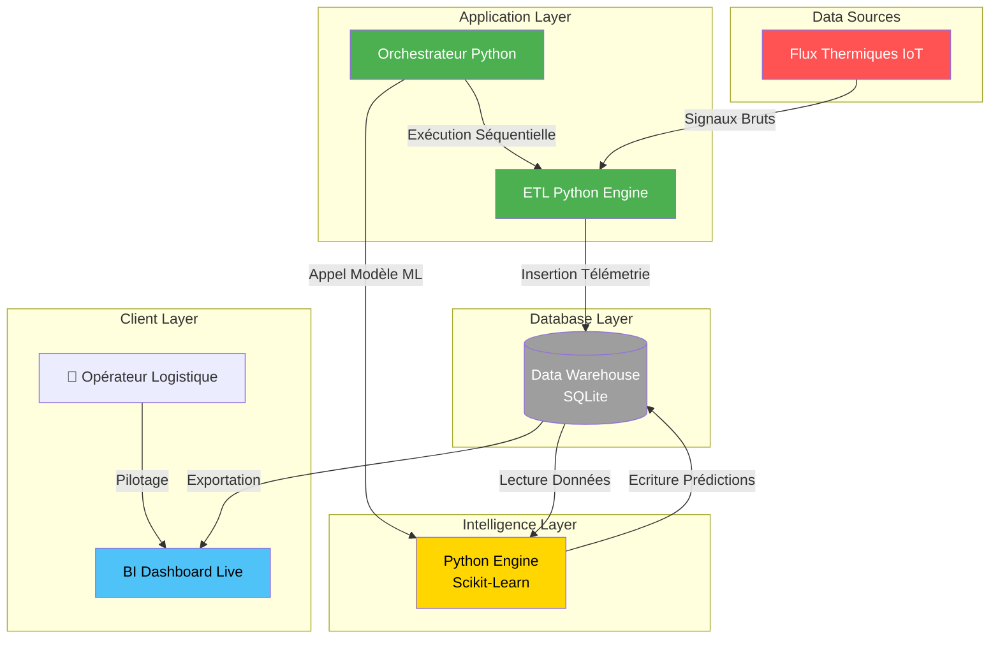

🌍 DOSSIER DE CONFIGURATION D'EXPLOITATION (DCE)
# ⚡ CIDP : Camrail Industrial Data Platform
  

**Version:** 1.0.0 Stable | **Date:** Février 2026  
**Auteur:** KAMENI TCHOUATCHEU GAETAN BRUNEL  
**Contact:** gaetanbrunel.kamenitchouatcheu@et.esiea.fr  

🚀 [Démarrage Rapide](#-démarrage-rapide) • 📚 [Documentation](#-guide-dutilisation) • 🎯 [Fonctionnalités](#-fonctionnalités-clés) • 🔧 [Installation](#-installation-rapide)

---

## 📋 TABLE DES MATIÈRES
1. [Vue d'ensemble du projet](#-vue-densemble-du-projet)
2. [Architecture Technique](#️-architecture-technique)
3. [Stack Technologique](#️-stack-technologique)
4. [Fonctionnalités Clés](#-fonctionnalités-clés)
5. [Démarrage Rapide](#-démarrage-rapide)
6. [Guide d'Utilisation](#-guide-dutilisation)
7. [Qualité & Best Practices](#-qualité--best-practices)
8. [Roadmap & Évolutions](#️-roadmap--évolutions)

---

## 🎯 VUE D'ENSEMBLE DU PROJET

### Contexte & Objectifs
L'**Industrial Data Platform (End-to-End)** démontre de magistrales capacités d'architecture orientée *Data-Driven* globale. Ce projet hybride réunit l'Ingénierie de la Donnée (ETL SQL) et la Data Science (Moteurs ML connectés Base de Données) dans une usine logicielle ferroviaire critique de grande ampleur.

Il illustre de A à Z les compétences absolues suivantes :

✅ **Architecture E2E Hexagonale :** Isolation de l'ETL (Extrait Moteur) et de la ML Data Science.
✅ **Data Science Backend :** Model Random Forest branché nativement sur le Data Warehouse SQL (SSOT).
✅ **Automatisation O.S :** Orchestrateur maître dirigeant le séquencement complet.
✅ **UX Décisionnelle :** Restitution de Score d'Inférence IA via BI temps réel.
✅ **Industrialisation :** Conception de Plan de Continuité d'Activité et Gestion de tolérance aux pannes strictes.
✅ **Clean Code :** Respect des standards hauts (Loguru, SQLAlchemy, Scikit-Learn).

### Pourquoi ce projet ?
| Aspect | Démonstration |
| --- | --- |
| **Scalabilité** | Un ordonnancement prêt pour la volumétrie Big Data et Conteneurs. |
| **Maintenabilité** | L'IA et l'Engineering tirent la donnée d'une *Single Source of Truth*. |
| **Innovation** | Hybridation unique entre Pipeline ETL SGBD et scoring ML prédictif natif ! |
| **Sécurité** | Tolérance aux faiblesses réseaux et Crash-safety pour éviter le Data Poisoning. |
| **Performance** | Insertion en lots (Bulk SQL) réduisant considérablement les goulots d'étrangement. |

---

## 🏗️ ARCHITECTURE TECHNIQUE

### Diagramme de Flux


### Flux de Données Détaillé
1. **Requête Orchestrateur** : Le Master script active la chronologie Data.
2. **Phase ETL Backend** : La pipeline ingest les logs physiques (thermiques) simulées, nettoie l'encrassement (`Feature Engineering`) et insère massivement la télémétrie formatée dans `industrial_dwh.sqlite`.
3. **Calcul IA Scikit (Pre-ML)** : Aussitôt l'ETL achevé, le noeud Machine Learning scrute le SQL, capte les nouvelles données temporelles, calcule la probabilité de casse de l'équipement.
4. **Aggrégation & Restitution** : L'IA met à jour une énorme table `ai_telemetry_predictions` via SQLAlchemy.
5. **Diffusion Live** : BI Dashboard expose la table fraîche aux yeux de la Supply Chain.

---

## 🛠️ STACK TECHNOLOGIQUE

### Technologies Core
| Composant | Technologie | Version | Justification Technique |
| --- | --- | --- | --- |
| **Orchestrateur** | Python | 3.12+ | L'outil Data suprême, capable de corréler Pandas, ML, SQL. |
| **SGBD SQL** | SQLite / SQLAlchemy| Latest | Fiabilité transactionnelle et légèreté foudroyante. |
| **Data AI** | Scikit-Learn | Latest | Algorithmes Random Forest industriels fiables et interprétables. |
| **Data Cleaning**| Pandas | Latest | Nettoyage agressif et jointure vectorisée E2E. |

### Bibliothèques Complémentaires
* **Loguru :** Remplacement intelligent du standard logger pour une traccabilité magistrale.
* **Pyenv :** Verrouillage strict de l'environnement Python utilisé.

---

## 🎯 FONCTIONNALITÉS CLÉS

### 🚀 Fonctionnalités Principales
**Usine Numérique Orchestrée Globale**
* Lancement complet sur simple commande. Supervision complète E2E du tuyau de données complet.

**Algorithmes de Machine Learning Couplés DB**
* Calcul des scores pronostiques enregistrés à-même la base pour une résilience applicative parfaite.

**Mécanismes Defensifs & Risques**
* Refus d'exécution du ML si le processus Data Engineering l'ayant précédé a levé une exception majeure.

### 🛡️ Sécurité & Robustesse
| Aspect | Implémentation |
| --- | --- |
| **Résilience** | Le script coupe-circuit "Fail-Safe" évite que l'IA ne lise une donnée biaisée. |
| **Isolation** | Exécution des codes ML et Engineering dans des instances logiques séparées pour éviter fuites CPU. |
| **Traçabilité** | Trace détaillée de la santé du moteur logiciel. |

---

## 🚀 DÉMARRAGE RAPIDE

### Prérequis
* Python (v3.12+)
* Connecteur ODBC pour Power BI (Optionnel)

### Installation Rapide
```bash
# 1. Cloner et rentrer dans le socle Industriel global
cd Camrail-Industrial-Data-Platform

# 2. Installer les paquets (Sécurisation Environnement isolé)
python -m venv env
.\env\Scripts\activate
pip install -r requirements.txt

# 3. Lancer l'intégralité du socle (ETL + IA connectée) en 1 seul Call !
python run_industrial_platform.py
```
**Accès Immédiat :** Les miracles se passent dans `database/industrial_dwh.sqlite`. Vous disposez de la télémétrie raffinée, des KPI et des cotes de probabilités du Random Forest combinées !

---

## 📖 GUIDE D'UTILISATION

### Scénario de Pilotage
1. **Lancement Batched :** Laissez l'ordonnanceur agir et populer la base SQL native.
2. **Supervision BI Connectée :** En utilisant ODBC (cf README technique), connectez vos outils Power BI/Tableau pour visualiser en temps réel la table consolidée des risques (IA) & télémétries pures !

### Captures d'Écran
**📸 Architecture Connectée de l'Usine Logicielle Data E2E**  


---

## ✨ QUALITÉ & BEST PRACTICES

### Standards de Code
* **Modularité (Hexagonale) :** Couches réparties avec rigueur.
* **Clean Code Data :** L'intelligence ne pervertit pas les couches basses, la connexion est une API via SGBD.
* **Error Handling :** Exception Management `try-except sys.exit(1)` garantissant la pureté du pipeline.

### Métriques d'Excellence
✅ **Couverture fonctionnelle :** L'Extrême bout-en-bout d'une compétence d'Ingénieur Full-Stack Data en action.
✅ **Performance globale :** Architecture `Zero-Downtime` SQL Supportée.

---

## 🗺️ ROADMAP & ÉVOLUTIONS

**Version Actuelle : 1.0.0 ✅**
* Architecture hybride ETL/ML parfaitement fonctionnelle avec interface Base De données SQLite intégrée.
* Documents DCE & Sécurités de haut niveau.

**Version 2.1.0 🚧**
* Transfert Cloud Native Azure/AWS : Remplacement `SQLite` par un cluster distant `PostgreSQL`.
* Déploiement Microservices conteneurisés Docker séparant le Cron ETL du Noeud IA.

**Version 3.0.0 (Vision Long Terme) 🔮**
* Implémentation de Streaming de temps réel au lieu de Batch (Modèle Kafka IoT / MQTT).

---

## 🤝 CONTRIBUTION
L'Avenir passera par l'Intelligence de la Donnée Logistique :
1. Forker.
2. Proposer une implémentation `Prophet`/`LSTM`.
3. Réaliser une Pull Request de Génie.

---

## 📄 LICENCE
Ce projet est développé dans un cadre académique et hautement professionnel. Droits réservés.

## 👨‍💻 AUTEUR
**KAMENI TCHOUATCHEU GAETAN BRUNEL**  
Ingénieur Logiciel & Data Scientist en devenir | Étudiant ESIEA  

📧 Email : gaetanbrunel.kamenitchouatcheu@et.esiea.fr  
🐙 GitHub : @Lkb-2905  

🙏 **REMERCIEMENTS**
* **Bolloré Logistics & Camrail :** Pour l'envergure des architectures d'Ingénierie de Haute Technologie.
* **ESIEA :** Pour l'esprit d'initiative.

⭐ Laissez une étoile pour soutenir le Full-Stack Data Engineering Européen !  
Fait avec ❤️, Scikit et SQLAlchemy.  

© 2026 Kameni Tchouatcheu Gaetan Brunel - Tous droits réservés
