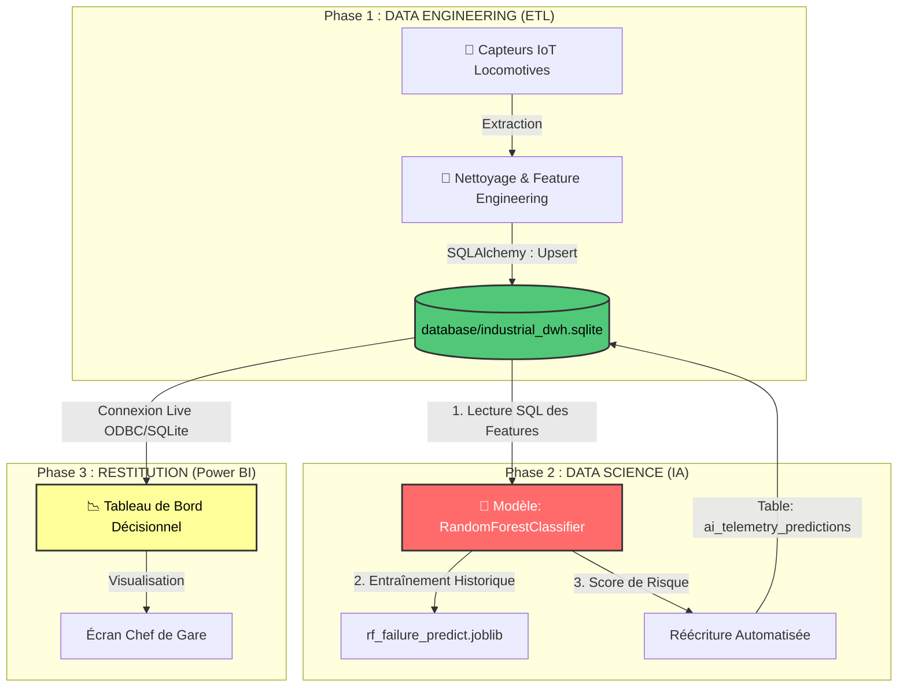

🌍 DOSSIER DE CONFIGURATION D'EXPLOITATION (DCE)
# 🚂 Camrail Industrial Data Platform (End-to-End) V1.0
   

**Version:** 1.0.0 Stable | **Date:** Février 2026  
**Auteur:** KAMENI TCHOUATCHEU GAETAN BRUNEL  
**Contact:** gaetanbrunel.kamenitchouatcheu@et.esiea.fr

🚀 [Démarrage Rapide](#-démarrage-rapide) • 📚 [Documentation](#-guide-dutilisation) • 🎯 [Fonctionnalités](#-fonctionnalités-clés) • 🔧 [Installation](#-installation-complète)

---

## 📋 TABLE DES MATIÈRES
1. [Vue d'ensemble du projet](#-vue-densemble-du-projet)
2. [Architecture Technique](#️-architecture-technique)
3. [Stack Technologique](#️-stack-technologique)
4. [Fonctionnalités Clés](#-fonctionnalités-clés)
5. [Démarrage Rapide](#-démarrage-rapide)
6. [Installation Complète](#-installation-complète)
7. [Guide d'Utilisation](#-guide-dutilisation)
8. [Qualité & Best Practices](#-qualité--best-practices)
9. [Roadmap & Évolutions](#️-roadmap--évolutions)

---

## 🎯 VUE D'ENSEMBLE DU PROJET

### Contexte & Objectifs
Ce projet démontre la mise en œuvre d'une architecture de données de bout en bout (End-to-End) unifiant l'**Ingénierie de Données (ETL)** et la **Data Science (IA)**. Il s'inscrit dans le contexte critique de la logistique ferroviaire de fret (Camrail - Bolloré Logistics à Douala), illustrant un profil "Full-Stack Data".

✅ **Data Engineering (Extraction & Chargement) :** Orchestration d'un pipeline ETL simulant des dizaines de milliers de lignes de télémétrie vers un SQL Data Warehouse.
✅ **Data Transformation (Nettoyage) :** Feature engineering avancé avec Pandas (Moyennes glissantes thermiques et vibratoires des essieux).
✅ **Data Science (Machine Learning) :** Algorithme de Random Forest se connectant directement au SQL pour scorer le risque de pannes des locomotives et réinsérant ses résultats fermement dans la base de données.
✅ **Data Visualization :** Spécifications pour une connexion en "Live" de Power BI à cette même base SQlite.
✅ **Automatisation IT :** Script d'orchestration global `run_industrial_platform.py` prêt pour un scheduler nocturne (CRON de nuit).

### Pourquoi ce projet ?
| Aspect | Démonstration |
| :--- | :--- |
| **Gouvernance de la Donnée** | Éviction des fichiers plats au profit d'une Source Unique de Vérité (SSOT) en SQL. |
| **Bout en Bout** | Autonomie totale de la captation physique (simulée) jusqu'au tableau de bord du Décideur. |
| **Maintenabilité** | Architecture hexagonale où ETL et Modélisation Machine Learning sont cloisonnés en sous-dossiers distincts. |
| **Business Value** | KPI calculés (Alertes pannes) immédiatement interprétables (Passage d'une maintenance à date fixe à prescriptive). |

---

## 🏗️ ARCHITECTURE TECHNIQUE

### Diagramme de Flux (Architecture End-to-End)



### Explication du Flux

1. **Script de Tête (`run_industrial_platform.py`) :** C'est le chef d'orchestre. Lorsqu'il est lancé, il exécute les deux phases séquentiellement avec une gestion des exceptions.
2. L'extraction (**`src/data_engineering/extract.py`**) génère 10 000 points de télémétrie bruts simulés (Pression d'huile, Température moteur).
3. La transformation (**`src/data_engineering/transform.py`**) crée les agrégats glissants (Rolling Means).
4. Le chargeur (**`src/data_engineering/load.py`**) insère de façon transactionnelle les lignes traitées dans le *Data Warehouse* central (SQLite via SQLAlchemy).
5. Aussitôt l'ETL terminé, l'Intelligence Artificielle (**`src/data_science/train_and_predict.py`**) se connecte en SQL (SELECT), s'entraîne sur l'usure des locomotives, débusque les pannes imminentes, et génère et insère instantanément une table prédictive ("Score de risque probabilités = [0.1...0.99]") `ai_telemetry_predictions` dans ce même Data Warehouse SQL !

---

## 🛠️ STACK TECHNOLOGIQUE

### Technologies Core
| Composant | Technologie | Version | Justification Technique |
| :--- | :--- | :--- | :--- |
| **Langage Principal** | Python | 3.12+ | L'écosystème absolu du Data Engineer et Data Scientist |
| **Moteur SGBD SQL**| SQLite3 | - | Moteur SQL embarqué ultraléger, remplaçable facilement par PostgreSQL via l'engine |
| **Data Engineering** | Pandas & SQLAlchemy | 2.1+ / 2.0+ | Extraction vectorisée et ORM Base de Données ultra-robuste |
| **Machine Learning** | Scikit-Learn | 1.3+ | Puissance des Random Forest, hautement explicable à l'industrie |
| **Reporting KPI** | Power BI | - | Connexion ODBC directe au DWH SQL pour rafraîchissement temps réel |
| **Tracabilité** | Loguru | 0.7+ | Traces asynchrones magnifiquement colorées en console |

---

## 🎯 FONCTIONNALITÉS CLÉS

### 🚀 Fonctionnalités Principales

**1. Orchestrateur Centralisé**
* Un script maître `run_industrial_platform.py` agit comme "Cron" process. Il pilote les dépendances et sécurise le flux (arrête tout si l'ETL échoue, évitant de faire crasher l'IA).

**2. Simulation & Feature Engineering Data**
* Génération pointue de 10k+ lignes avec des signaux de panne bruités (bruit gaussien de température moteurs). Lissage par moyenne mobile `Rolling` dans Pandas.

**3. IA Nativement Interconnectée au SGBD**
* Random Forest avec ajustement du poids des classes sous-représentées (`class_weight='balanced'`).
* L'IA requête directement sa base via SQL queries, garantissant la sûreté et la fraîcheur ("Source of Truth").

### 🛡️ Sécurité, Qualité & Robustesse
| Aspect | Implémentation |
| :--- | :--- |
| **Modularité Stricte** | Dossier `data_engineering` hermétique vis-à-vis de `data_science`. Le lien s'opère par contrat de données (La Base SQL). |
| **Logs Structurés** | Historisation de l'exécution dans `logs/platform_execution.log`. |
| **Versionning IA** | Les objets sérialisés (*modèle*.joblib) ont leur dossier dédié et mis sur GitHub LFS. |

---

## 🚀 DÉMARRAGE RAPIDE

### Prérequis
```bash
# Vérifier Python
python --version  # Doit être >= 3.12
```

### Installation Express
```bash
# 1. Naviguer dans le dossier du projet
cd Camrail-Industrial-Data-Platform

# 2. Créer un environnement virtuel
python -m venv env
.\env\Scripts\activate

# 3. Installer les dépendances
pip install -r requirements.txt

# 4. Lancer l'usine numérique (Orchestrateur E2E)
python run_industrial_platform.py
```
*(Une fois terminé, regardez dans le dossier `database/`, le fichier `industrial_dwh.sqlite` contiendra toutes vos tables, données nettoyées, et prédictions de pannes.)*

---

## 📖 GUIDE D'UTILISATION

### Analyse des Résultats
Une fois l'orchestrateur exécuté :
1. **Dossier `database/`** : Ouvrez `industrial_dwh.sqlite` avec un client SGBD léger comme [DB Browser for SQLite] ou [DBeaver].
2. **Tables disponbiles** : Inspectez les tables "fact_telemetry_features" (vos données pures formatées) et "ai_telemetry_predictions" (enrichies du `%_de_Risque_Panne`).
3. **Power BI** : Dans Power BI Desktop, connectez la source ODBC/SQLite sur le fichier `.sqlite` absolu.

---

## ✨ QUALITÉ & BEST PRACTICES

### Principes Appliqués
| Principe | Implémentation |
| :--- | :--- |
| **SSOT (Single Source Of Truth)** | L'unique point de passage de l'information est le Data Warehouse SQL (industrial_dwh). |
| **Separation of Concerns** | Extracteurs / Transformateurs / Chargeurs isolés dans des fichiers .py uniques. |
| **Data Imbalance (DS)** | Technique rigoureuse de stratification croisée appliquée à la scission d'apprentissage IA. |

---

## 🗺️ ROADMAP & ÉVOLUTIONS

**Version Actuelle : 1.0.0** ✅
* [x] Pipeline EXTRACT, TRANSFORM, LOAD complet en mémoire
* [x] Enrobement SGBD par SQLAlchemy Engine
* [x] Rétro-Connexion du Machine Learning et prédiction par scoring SQL
* [x] Design "End-to-End" achevé orienté Fret Logistique

**Version 1.1.0 (Prochaine Release)** 🚧
* Bascule dynamique sur un PostgreSQL Azure Cloud au lieu du ficher SQLite file-system.

---

## 👨‍💻 AUTEUR
**KAMENI TCHOUATCHEU GAETAN BRUNEL**  
*Ingénieur Logiciel & Data | Étudiant ESIEA*

📧 Email : gaetanbrunel.kamenitchouatcheu@et.esiea.fr  
🐙 GitHub : @Lkb-2905  

© 2026 Kameni Tchouatcheu Gaetan Brunel - Tous droits réservés
