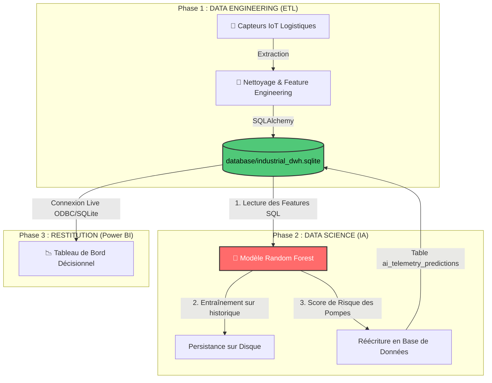

# 🌍 TotalEnergies Industrial Data Platform (End-to-End)

   

Ce dépôt est **l'aboutissement d'une architecture Data complète (End-to-End)**. Il combine l'**Ingénierie de Données (ETL)** et la **Data Science (IA)** au sein d'un seul et même système industriel harmonisé.

---

## 🏗️ Architecture "End-to-End"

Au lieu de faire de la Data Science sur des fichiers CSV isolés, ce système prouve la capacité à construire le cycle de vie complet de la donnée dans une entreprise :



### Le Flux en Détail :
1. **Script de Tête (`run_industrial_platform.py`) :** C'est le chef d'orchestre. Lorsqu'il est lancé (par exemple par un Scheduler nocturne), il exécute les deux phases séquentiellement.
2. L'extraction (**`extract.py`**) génère 10 000 points de télémétrie bruts (Pression, Température).
3. La transformation (**`transform.py`**) crée les agrégats glissants (Rolling Means).
4. Le chargeur (**`load.py`**) insère de façon sécurisée (avec "Rollback" si erreur) les millions de lignes dans le *Data Warehouse* SQLite central.
5. Aussitôt l'ETL terminé, l'Intelligence Artificielle (**`train_and_predict.py`**) "Fetch" cette table SQL, s'entraîne, débusque les pannes imminentes, et **génère une table de prédiction directement dans le base de données locale**.

## 🚀 Démarrage Rapide

```bash
# 1. Cloner l'architecture
git clone https://github.com/Lkb-2905/TotalEnergies-Industrial-Data-Platform.git
cd TotalEnergies-Industrial-Data-Platform

# 2. Installer les paquets
pip install -r requirements.txt

# 3. Lancer l'usine numérique (Orchestrateur Complet)
python run_industrial_platform.py
```

*Une fois le script terminé, regardez dans le dossier `database/`, la base SQLite est prête à être branchée sur votre Power BI pour afficher les prévisions du site !*
